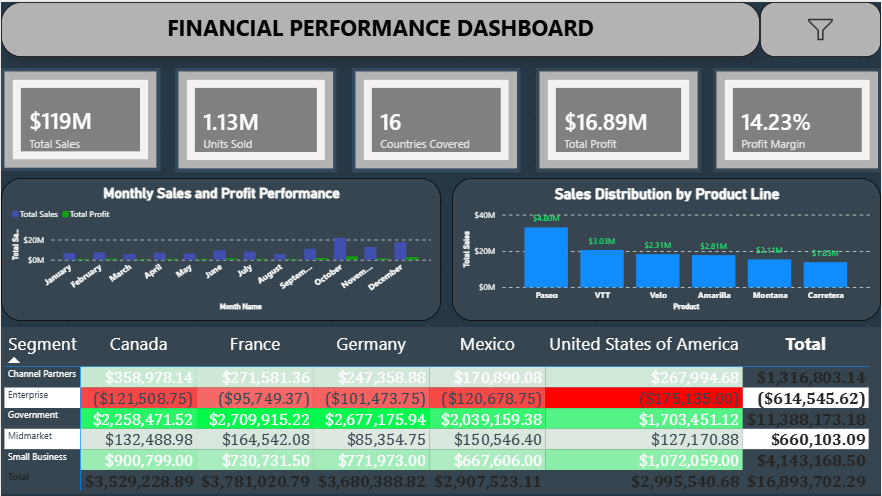

# Financial Performance Dashboard

An interactive Power BI dashboard analyzing sales, profitability, market distribution, and segment performance across 16 countries. Built as a single-page executive summary translating raw transactional data into actionable business insights.

*Replace `dashboard-preview.png` with a screenshot of your finished dashboard, placed in the repo root.*

## 🔗 Overview

| | |
|---|---|
| **Tool** | Power BI Desktop (Power Query, DAX, Data Modelling) |
| **Data** | Financial transaction dataset — Sales, COGS, Discounts, Profit, Sale Price |
| **Scope** | 16 countries, 5 market segments, 6 product lines |

## 🎯 Objectives

- Deliver a single-page visual executive summary translating raw financial rows into top-line KPIs
- Track month-over-month sales and profitability trends
- Identify which product lines drive the largest share of revenue
- Surface profitability differences across market segments and geographic territories

## 📊 Dashboard Components

- **KPI Header Row** — Total Sales, Units Sold, Countries Covered, Total Profit, Profit Margin
- **Monthly Sales and Profit Performance** — combined trend chart, corrected to chronological (Jan–Dec) order
- **Sales Distribution by Product Line** — ranked column chart across 6 product lines
- **Segment Profitability Matrix** — conditional-formatted (red-to-green) matrix mapping Segment × Country profitability

## 🛠️ Process & Problem-Solving

This project involved more than assembling visuals — several real data modelling and visualization issues came up during development and had to be diagnosed and fixed:

- **Broken trend chart** — traced a single-bar chart bug to the Date field being drilled to Day-level via Power BI's automatic date hierarchy. Fixed by rebuilding the axis on a standalone Month Name field.
- **Chronological sorting** — Month Name defaulted to alphabetical order; fixed using Power BI's *Sort by Column* feature, linked to Month Number.
- **Negative values in the heatmap** — a treemap visual was silently zeroing out negative profit values. Investigated the raw data directly, confirmed genuine losses (concentrated in the Enterprise segment and Q4), and switched to a Matrix visual with conditional formatting to accurately display both profit and loss.
- **Labeling & contrast** — renamed an ambiguous "Total Covered" KPI to "Countries Covered," fixed inconsistent card backgrounds, and improved text contrast for readability.
- **Layout & alignment** — used Power BI's Align/Distribute tools and resized visuals to eliminate overflow and establish a consistent visual hierarchy.

## 💡 Key Insight

The **Enterprise segment operates at a loss in every country** in the dataset, concentrated notably in Q4. This only became visible after correcting the heatmap visual to properly display negative values instead of masking them as zero — a finding that would otherwise have gone unnoticed.

## 📈 Results

- Top-line KPIs: **$119M** Total Sales, **1.13M** Units Sold, **$16.89M** Total Profit, **14.23%** Profit Margin
- Government and Small Business segments deliver the largest share of profit
- Paseo and VTT are the top-performing product lines by revenue
- Enterprise segment flagged as a systemic loss-driver requiring further investigation (pricing/cost structure, not a regional anomaly)

## 🧰 Skills Demonstrated

- Power BI data modelling (date hierarchies, Sort by Column, DAX measures)
- Root-cause debugging of visualization errors rather than surface-level fixes
- Data validation (distinguishing real negative values from data entry errors)
- Dashboard design (visual hierarchy, alignment, contrast, labeling clarity)
- Translating a technical fix into a business recommendation

## 📁 Repo Contents

- `Financial Performance Dashboard.pbix` — the Power BI file
- `dashboard-preview.png` — screenshot of the finished dashboard
- `README.md` — this file

## 👤 Author

**Ajayi Oluwatimilehin Benjamin**
[LinkedIn](https://linkedin.com/in/benaj619) · [Portfolio](https://benaj619.my.canva.site) · benaj619@gmail.com
